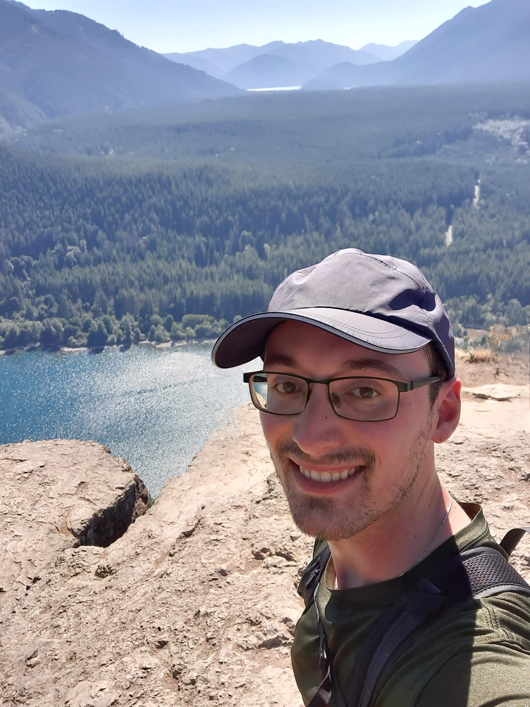

<head>
<link rel="stylesheet" href="style.css">
</head>
<body>

<h4><a href="#AboutMe">About Me</a></h4>
<h4><a href="#Research">Research</a></h4>
<h4><a href="#Tools">Software/Tools</a></h4>
<h4><a href="#Hobbies">Non-Academic Interests</a></h4>

<b>email: </b>bechler4[at]msu[dot]edu

<b>github: </b><a href="https://github.com/ConnorBechler">https://github.com/ ConnorBechler</a>

<h1 id='AboutMe'>Connor Bechler</h1>

<h2>About Me</h2>

I am currently a PhD student in Linguistics at Michigan State University, where I am a member of the <a href="https://mi-diaries.org">MI Diaries Project</a>. 

My current research focuses on applying speech and language technology to sociolinguistics, language documentation, and corpus linguistics.

I graduated with a BA in Linguistics, Literature, and Chinese from Calvin University in 2020, and an MA in Linguistic Theory and Typology from the University of Kentucky in 2023.

<h2 id='Research'>Research</h2>

Bechler, C. (2024). <i>Automatic Analysis of Audio Diary Speech Duration and Relative Speech Volume</i>. [Poster presentation abstract]. Submitted to the American Dialect Society 2025 Annual Meeting, Philadelphia, Pennsylvania, United States. <a href="https://ConnorBechler.github.io/research/ADS 2025 Abstract.pdf" target="_blank">[Abstract PDF]</a>

Bechler, C. (2024). <i>Evaluating wav2vec 2.0 Speech Recognition and Forced Alignment on a Multi-Varietal Language Documentation Collection</i>. [Conference presentation abstract]. Submitted to New Ways of Analyzing Variation (NWAV) 52, Miami, Florida, United States. <a href="https://ConnorBechler.github.io/research/NWAV 52 Abstract.pdf" target="_blank">[Abstract PDF]</a>

Bechler, C. (2023, October 13-15). <i>Automatic Transcription of Documentation Recordings for Sociolinguistic Analysis: Speech Recognition and Forced-Alignment for Northern Prinmi</i> [Poster presentation]. New Ways of Analyzing Variation (NWAV) 51, Queens, New York, United States. <a href="https://ConnorBechler.github.io/research/NWAV_51_Poster_Final.pdf" target="_blank">[Poster PDF]</a>

Bechler, C. (2023). Automatic Transcription of Northern Prinmi Oral Art: Approaches and Challenges to Automatic Speech Recognition for Language Documentation. <a href="https://uknowledge.uky.edu/ltt_etds/51/">[External Link to Thesis PDF]</a>

Kayali, N. & Bechler, C. (2023, March 3-4). <i>Investigating Historical Language Ideologies in Multilingual Contexts: A Novel Sociohistorical Framework</i> [Poster presentation]. 15th Annual Meeting of the Illinois Language and Linguistics Society, Champaign-Urbana, Illinois, United States. <a href="https://ConnorBechler.github.io/research/ills_poster-2023.pdf" target="_blank">[Poster PDF]</a>

<h2 id='Tools'>Software/Tools</h2>

<a href="https://github.com/midiaries/datahub">The MI Diaries Research Framework</a>: I did not create this, but I bug-tested and documented a portion of it. An excellent suite of tools for creating, navigating, and annotating audio corpora.

<a href="https://github.com/ConnorBechler/dispeecheval">DiSpeechEval</a>: A python tool I am developing for the quick summarization of speech quantity and quality using voice activity detection.

<a href="https://github.com/ConnorBechler/wav2vec2fasr-repo">wav2vec2fasr</a>: A collection of resources and python interface I am developing for finetuning wav2vec2 models for low-resource automatic speech recognition and forced alignment.

<h2 id='Hobbies'>Non-Academic Interests</h2>

I greatly enjoy modern fencing, primarily epee. I have dabbled in game design. Hiking and backpacking provide me with a great deal of joy. While I am not always the fastest chef, I find cooking to be both soothing and satisfying. I enjoy both tea and coffee without particular partisanship.

I am always in the market for new books, recipes, and hiking spots! If you are feeling generous, send me your recommendations via email.

</body>