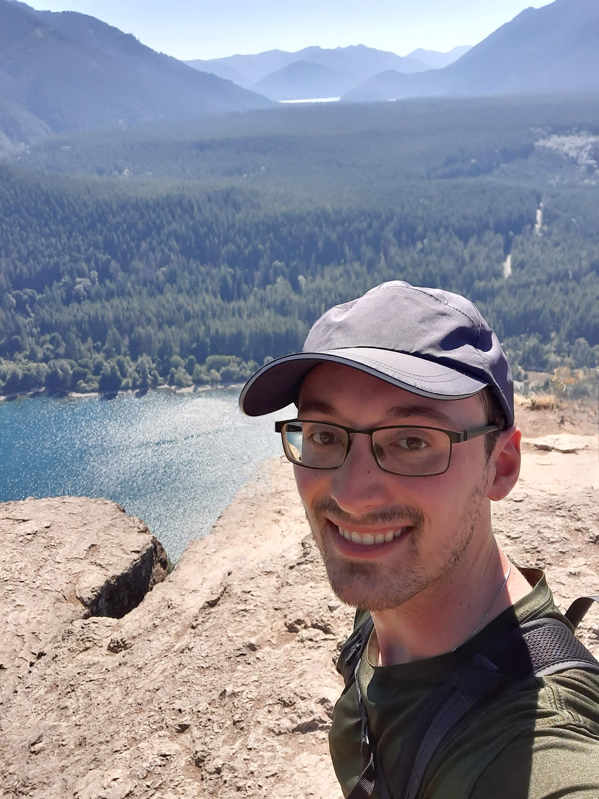
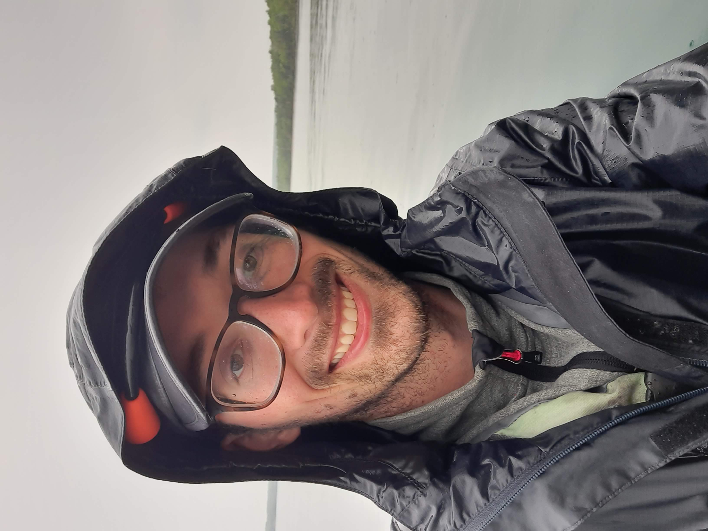

<head>
<link rel="stylesheet" href="style.css">
</head>
<body>

<h4><a href="#AboutMe">About Me</a></h4>
<h4><a href="#Research">Research</a></h4>
<h4><a href="#Tools">Software/Tools</a></h4>
<h4><a href="#Hobbies">Non-Academic Interests</a></h4>

<b>email: </b>bechler4[at]msu [dot]edu

<b>github: </b><a href="https://github.com/ConnorBechler">https:// github.com/ ConnorBechler</a>

<h1 id='AboutMe'>Connor Bechler</h1>

<!---->

<h2>About Me</h2>

I am a PhD student in Linguistics at Michigan State University, where I am a member of the <a href="https://mi-diaries.org">MI Diaries Project</a>, <a href="https://sociolab.msu.edu/">Sociolinguistics Lab</a>, <a href="https://karthikdurvasula.gitlab.io/MSUPhonoGroupAndEMALab.html">PhonoGroup</a>, and <a href="https://penndutchdialects.org/">PennDutch Dialects Project</a>.

 I am particularly interested in theories of language variation and change, language attitudes/ideologies, and the phonetics/phonology interface.

My current work has two main threads: (I) developing and employing computational tools to facilitate the collection, annotation, and analysis of speech corpora, particularly for sociolinguistics and language documentation, and (II) exploring and testing linguistic theories with formal models.

I graduated with an MA in Linguistic Theory and Typology from the University of Kentucky in 2023 and a BA in Linguistics, Literature, and Chinese from Calvin University in 2020.

<h2 id='Research'>Research</h2>

Wang, X., Wagner, S., Lin, Y. H., & <b>Bechler, C.</b> (2026, April 29). Tone sandhi changes in Tianjin Mandarin and rural-to-urban migration. [Manuscript submitted for publication]. Department of Linguistics, Languages, and Cultures, Michigan State University.

<b>Bechler, C.</b> (2025, November 6). <i>Modeling and Documenting Variation across Prinmi Varieties</i>. [Poster presentation]. New Ways of Analyzing Variation (NWAV) 53, Ann Arbor, Michigan, United States. <a href="https://ConnorBechler.github.io/research/NWAV 53 Abstract.pdf" target="_blank">[Abstract PDF]</a><a href="https://ConnorBechler.github.io/research/NWAV 53 2025 Poster.pdf" target="_blank">[Poster PDF]</a>

<b>Bechler, C.</b> (2025, October 10). <i>Two forms or two processes? Accounting for ambiguous tone spreading in Prinmi</i>. [Poster presentation]. Mid-Continental Phonetics and Phonology Conference (MidPhon) 30, Bloomington, Indiana, United States. <a href="https://ConnorBechler.github.io/research/CB-MidPhonAbstract-2025.pdf" target="_blank">[Abstract PDF]</a> <a href="https://ConnorBechler.github.io/research/MidPhon 2025 Poster for Print.pdf" target="_blank">[Poster PDF]</a>

<b>Bechler, C.</b> (2025, January 11). <i>Automatic Analysis of Audio Diary Speech Duration and Relative Speech Volume</i>. [Conference presentation]. American Dialect Society 2025 Annual Meeting, Philadelphia, Pennsylvania, United States. <a href="https://ConnorBechler.github.io/research/ADS 2025 Abstract.pdf" target="_blank">[Abstract PDF]</a> <a href="https://ConnorBechler.github.io/research/ADS 2025.pptx" target="_blank">[Slides]</a>

<b>Bechler, C.</b> (2024, November 9). <i>Evaluating wav2vec 2.0 Speech Recognition and Forced Alignment on a Multi-Varietal Language Documentation Collection</i>. [Conference presentation]. New Ways of Analyzing Variation (NWAV) 52, Miami, Florida, United States. <a href="https://ConnorBechler.github.io/research/NWAV 52 Abstract.pdf" target="_blank">[Abstract PDF] </a><a href="https://ConnorBechler.github.io/research/NWAV 52_Presentation_Final.pptx" target="_blank">[Slides]</a>

<b>Bechler, C.</b> (2024, November 1). <i>Developing Semi-Automatic Annotation for Documentation and Sociolinguistic Analysis​: Lessons from a Multi-Varietal Oral Art Collection​</i>. [Conference presentation]. Graduate Linguistics Expo at Michigan State (GLEAMS) 2024, East Lansing, Michigan, United States.

Sneller, B., Werner, R., Rechsteiner, J., & <b>Bechler, C.</b> (2024). MiDRF Admin Portal. <a href="https://zenodo.org/doi/10.5281/zenodo.13617857">https://zenodo.org/doi/10.5281/zenodo.13617857</a>

<b>Bechler, C.</b> (2023, October 14). <i>Automatic Transcription of Documentation Recordings for Sociolinguistic Analysis: Speech Recognition and Forced-Alignment for Northern Prinmi</i> [Poster presentation]. New Ways of Analyzing Variation (NWAV) 51, Queens, New York, United States. <a href="https://ConnorBechler.github.io/research/NWAV_51_Poster_Final.pdf" target="_blank">[Poster PDF]</a>

<b>Bechler, C.</b> (2023). Automatic Transcription of Northern Prinmi Oral Art: Approaches and Challenges to Automatic Speech Recognition for Language Documentation. <a href="https://uknowledge.uky.edu/ltt_etds/51/">[External Link to Thesis PDF]</a>

Kayali, N. & <b>Bechler, C.</b> (2023, March 3-4). <i>Investigating Historical Language Ideologies in Multilingual Contexts: A Novel Sociohistorical Framework</i> [Poster presentation]. 15th Annual Meeting of the Illinois Language and Linguistics Society, Champaign-Urbana, Illinois, United States. <a href="https://ConnorBechler.github.io/research/ills_poster-2023.pdf" target="_blank">[Poster PDF]</a>

<h2 id='Tools'>Software/Tools</h2>

<a href="https://github.com/midiaries/datahub">The MI Diaries Research Framework</a>: A suite of tools originally developed for the MI Diaries project for collaboratively creating, navigating, and annotating audio corpora. I've contributed to the framework's documentation, bug-testing, and development.

<a href="https://github.com/ConnorBechler/dispeecheval">DiSpeechEval</a>: A Python tool I am developing for the quick summarization of speech quantity and quality using voice activity detection.

<a href="https://github.com/ConnorBechler/wav2vec2fasr-repo">wav2vec2fasr</a>: A collection of resources and Python interface I am developing for finetuning wav2vec2 models for low-resource automatic speech recognition and forced alignment.

<h2 id='Hobbies'>Non-Academic Interests</h2>

In my free time, I enjoy reading (primarily fiction, although also essays and poetry), programming, epee fencing, hiking, backpacking, tea, and cooking (although I am not a particularly fast cook).

In 2025, I took up Shape Note singing, which has been a particular delight.

I am always in the market for new books, recipes, and hiking spots! If you feel generous, send me your recommendations via email!

</body>